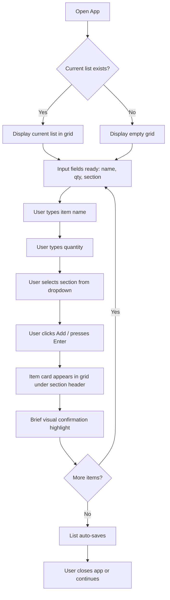
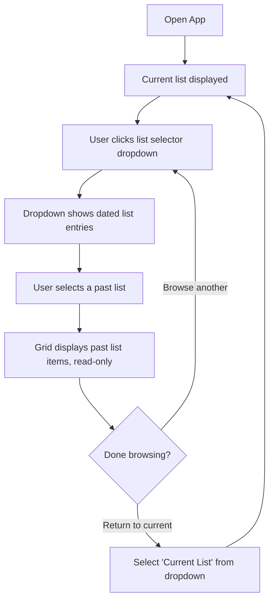
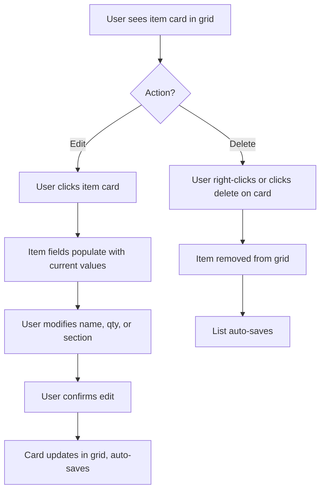

# UX Design Specification - grocery-shopping-list

**Author:** Hnucamend
**Date:** 2026-02-12

---

## Executive Summary

### Project Vision

A macOS desktop grocery list app built in C++. One user, one window, one job: build a weekly grocery list organized by store section and browse past lists. Design philosophy is "Ally Bank vibes" -- clean, minimal, data-respecting. Simplicity above all.

### Target Users

Solo user (tech-savvy, Mac, desktop-only) who plans meals weekly and builds a grocery list in a focused session at a desk. Currently using phone notes or store apps. Wants better organization, not more features.

### Key Design Challenges

1. **Item entry speed** -- 20-50 items per session. The input flow (name, quantity, section) must be fast and repeatable with minimal friction.
2. **Section assignment** -- needs a quick, simple way to pick a store section without slowing down entry.
3. **History browsing** -- past lists identifiable by date, scannable without clutter.

### Design Opportunities

1. **Keyboard-driven input** -- desktop app in focused sessions benefits from tab/enter flow over mouse clicking.
2. **Visual section grouping** -- simple visual distinction (color or subtle styling) makes the grouped list scannable at a glance.

### Design Principle

**Keep it simple.** No over-engineering the UI. A clean utility that does its job without drawing attention to itself. Every design decision should pass the test: "does this make the list easier to build or read?"

## Core User Experience

### Defining Experience

The core interaction is **adding grocery items to a list**, repeated 20-50 times per weekly session. The app is a single-window desktop utility with three input fields (item name, quantity, store section dropdown) and a visual grid display of item cards grouped by store section.

### Platform Strategy

- **macOS desktop only** -- single window application
- **Mouse and keyboard input** -- three discrete fields for item entry, dropdown for section selection
- **Offline by design** -- all data and images stored locally
- **Item images sourced from local filesystem** -- user provides their own images for grocery items, with a generic fallback for items without an image

### Effortless Interactions

- **Item entry**: Three fields (name, quantity, section dropdown) -- straightforward, no cleverness
- **Visual confirmation**: After adding an item, a visual signal confirms the item landed in the list (highlight, flash, or brief feedback)
- **Auto-save**: Lists persist without the user thinking about saving
- **Section grouping**: Items automatically sort into their section groups as they're added

### Critical Success Moments

- **First list completion**: The user finishes adding items and sees a clean grid of image cards grouped by section -- the list looks good and is immediately useful
- **History recall**: Opening the app weeks later and finding a past list instantly by date
- **The "better than notes" moment**: The visual card grid with images and section grouping makes it obvious this is more organized than a phone note

### Experience Principles

1. **Simplicity over features** -- every design decision passes the test: "does this make the list easier to build or read?"
2. **Visual recognition** -- image cards make items recognizable at a glance without reading text
3. **No surprises** -- standard desktop UI patterns, dropdown for sections, text fields for input. Nothing to learn.
4. **The list is the product** -- the grid view of grouped item cards IS the experience. Everything else supports it.

## Desired Emotional Response

### Emotional Goals

Standard modern desktop UI expectations:

- **In control** -- clear state, predictable behavior, no surprises
- **Efficient** -- fast input, minimal friction, get the job done
- **Organized** -- clean visual hierarchy, grouped information, trustworthy data

### Emotions to Avoid

- Frustration from slow or confusing interactions
- Distrust from lost or corrupted data
- Overwhelm from unnecessary complexity

### Design Implications

- Standard UI patterns -- no reinventing conventions
- Clear visual feedback for user actions
- Consistent, predictable behavior throughout
- Auto-save so the user never worries about data loss

## UX Pattern Analysis & Inspiration

### Inspiring Products Analysis

**Ally Bank (Web/Mobile Banking)**
- Clean typography with generous whitespace
- Data-first presentation -- numbers and information front and center, no decorative fluff
- Minimal color palette used intentionally (status, categories, not decoration)
- Clear information hierarchy -- you know where to look for what matters

### Transferable UX Patterns

- **Grid card layout** -- common in modern UIs for displaying collections of items visually (app stores, photo galleries, recipe apps). Adapts naturally to grocery item cards with images.
- **Section headers with grouped content** -- standard pattern for categorized lists. Section label sits above its group of cards.
- **Inline form input** -- input fields visible at all times (not hidden behind a button or modal). Name, quantity, dropdown always ready.
- **Visual feedback on action** -- brief highlight or animation when an item is added to confirm success.

### Anti-Patterns to Avoid

- **Modal dialogs for simple actions** -- don't make the user open a popup just to add an item
- **Gamification** -- no badges, streaks, achievements, or reward animations
- **Decorative UI elements** -- no gradients, shadows, or ornamental design that doesn't serve function
- **Hidden navigation** -- everything should be visible and reachable from the main window

### Design Inspiration Strategy

**Adopt:** Ally Bank's information density and clean typography. Grid card layout for item display.

**Adapt:** Banking-style data presentation adapted for grocery context -- section grouping replaces account categories, item cards replace transaction rows.

**Avoid:** Any visual complexity that doesn't directly help the user build or read a list.

## Design System Foundation

### Design System Choice

**wxWidgets with native macOS controls.** The app inherits macOS system styling -- standard buttons, text fields, dropdowns, scroll views, and window chrome. No custom design system needed.

### Rationale for Selection

- **Native look and feel** -- macOS users get familiar controls with zero design effort
- **Learning-first** -- spend time on C++ patterns, not UI theming
- **Simplicity** -- no design system to learn, configure, or maintain
- **Clean by default** -- native macOS controls already meet the "Ally Bank" standard of clean, no-nonsense UI

### Implementation Approach

- Use wxWidgets' standard widget set for all controls (text inputs, dropdowns, buttons, list/grid views)
- Item card grid will use wxWidgets panel/sizer layout with image controls
- Store section grouping via labeled panel sections or static box sizers
- Local images loaded from filesystem for item cards using wxImage/wxBitmap

### Customization Strategy

- **Minimal customization** -- rely on native controls wherever possible
- **Card styling** -- the item cards (image + name + quantity) are the one area requiring custom layout, built from basic wxWidgets panels and sizers
- **Color** -- use system colors by default; subtle section-distinguishing colors only if needed
- **Typography** -- system font throughout

## Defining Experience

### Core Interaction

**"Add items to a visual grocery list, fast."**

### User Mental Model

The user translates recipes from memory into individual grocery items. Name, quantity, store section -- repeat 20-50 times. Expects standard list app behavior: type, submit, see it appear.

### Experience Mechanics

1. **Initiation:** App opens with input fields visible and ready. No extra clicks to start.
2. **Interaction:** Type name → type quantity → select section from dropdown → submit. Item appears as a card in the grid under its section.
3. **Feedback:** Card appears in the grid with brief visual confirmation. Local image displayed if available, generic placeholder if not.
4. **Completion:** User stops adding. List auto-saves. No save button, no finish action.

### Pattern Analysis

All established UI patterns -- text fields, dropdowns, grid layouts, auto-save. The image card grid is a standard pattern adapted for grocery items. Nothing novel, nothing to learn.

## Visual Design Foundation

### Color System

**macOS system defaults.** No custom color palette. Native controls provide the standard macOS light theme colors automatically.

- **Background:** System window background (white/light gray)
- **Text:** System label color (black/dark gray)
- **Controls:** Native button, dropdown, and input styling
- **Section distinction:** If needed, use subtle system-provided alternate background colors to visually separate store sections in the grid. No custom hex values.

### Typography System

**System font throughout.** macOS San Francisco font via wxWidgets default. No custom fonts.

- Headings: System font, bold, standard sizes for section labels
- Body: System font, regular weight for item names and quantities
- No custom type scale -- use wxWidgets default sizing

### Spacing & Layout Foundation

- **Layout:** Single window with two zones -- input area (top) and item grid (below)
- **Spacing:** wxWidgets sizer defaults. Standard margins and padding from native controls.
- **Grid:** Item cards arranged in a responsive grid that fills the window width, wrapping to new rows as needed
- **Density:** Moderate -- enough spacing that cards are distinct, not so much that the list feels empty

### Accessibility Considerations

- Native macOS controls provide built-in accessibility support (VoiceOver, keyboard navigation)
- System colors automatically handle contrast requirements
- No custom accessibility work needed beyond what wxWidgets provides natively

## Design Direction Decision

### Chosen Direction

Single window, three-zone layout with native macOS controls:

1. **Title bar area** -- app name + list selector dropdown (current list / historical lists)
2. **Input bar** -- item name field, quantity field, section dropdown, add button. Always visible, always ready.
3. **Item grid** -- scrollable area of image cards grouped under section headers

### Design Rationale

- **One layout, no alternatives needed** -- wxWidgets native controls + system defaults means the visual direction is predetermined. The only decision is spatial arrangement.
- **Input at top, output below** -- follows standard form-to-results pattern. User types at the top, sees results grow below.
- **Section headers as dividers** -- simple text labels separate card groups. No tabs, no sidebars, no collapsible panels.
- **Grid fills available space** -- cards wrap to fill window width, adapting if the window is resized.

### Implementation Approach

- wxWidgets `wxBoxSizer` for vertical layout (title → input → grid)
- Input bar uses `wxBoxSizer` horizontal layout for fields + button
- Grid area uses `wxScrolledWindow` with `wxWrapSizer` for card flow
- Each card is a `wxPanel` containing `wxStaticBitmap` (image) + `wxStaticText` (name, quantity)
- Section headers are `wxStaticText` with bold font spanning full width

## User Journey Flows

### Journey 1: Add Items to List

**Key interactions:**
- Entry point: app launch, fields immediately ready
- Core loop: name → quantity → section → add → repeat
- Exit: just stop. Auto-save handles persistence.
- Error case: if name is empty, add button does nothing (no error dialog)

### Journey 2: Browse History

**Key interactions:**
- Entry point: list selector dropdown in title area
- Past lists shown by date (e.g., "Feb 9, 2026", "Feb 2, 2026")
- Read-only view -- no editing or deleting items from historical lists
- Return to current list via same dropdown

### Journey 3: Edit/Delete Item

### Flow Patterns

- **Always-ready input** -- fields are visible and ready at all times, no "add mode" toggle
- **Auto-save everywhere** -- every add, edit, and delete triggers automatic persistence
- **Dropdown as navigator** -- the list selector dropdown is the single navigation mechanism for switching between current and historical lists
- **No modals** -- all interactions happen inline in the main window

## Component Strategy

### Design System Components

wxWidgets provides all foundation controls needed for the input and navigation areas:

- **wxTextCtrl** -- item name and quantity input fields
- **wxChoice** -- store section dropdown selector and list history selector
- **wxButton** -- add item button
- **wxStaticText** -- section header labels, item text labels
- **wxScrolledWindow** -- scrollable container for the item grid area
- **wxBoxSizer** -- vertical and horizontal layout management
- **wxWrapSizer** -- flowing grid layout for item cards within each section

No third-party widget libraries needed. All controls use native macOS styling.

### Custom Components

#### Item Card

**Purpose:** Display a single grocery item as a visual card with image, name, and quantity
**Content:** Item image (from local filesystem or generic placeholder), item name, quantity
**Actions:** Click to edit (populates input fields), right-click or delete button to remove
**States:** Default, selected/editing (subtle highlight), newly-added (brief flash confirmation)
**Variants:** Single size -- consistent card dimensions across all items
**Accessibility:** Native wxWidgets keyboard navigation; card content readable by VoiceOver

**Implementation:** `wxPanel` containing a vertical `wxBoxSizer` with:
- `wxStaticBitmap` (item image, fixed size, loaded from local path or fallback)
- `wxStaticText` (item name)
- `wxStaticText` (quantity)

#### Section Group

**Purpose:** Visually group item cards under a store section header
**Content:** Section name label followed by a flowing grid of item cards
**Actions:** None -- display-only container
**States:** Default only. Empty sections are hidden (no empty state displayed).
**Variants:** None -- all sections use identical layout

**Implementation:** `wxStaticText` (bold, full-width section label) followed by `wxWrapSizer` containing item card panels. One section group per store section that has items.

#### Add Confirmation Feedback

**Purpose:** Provide brief visual confirmation when an item is successfully added
**Content:** Temporary highlight or background color change on the newly added item card
**Actions:** None -- automatic, fades after ~500ms
**States:** Active (highlighted), then returns to default

**Implementation:** `wxTimer`-driven background color change on the new card's `wxPanel`, reverting after a short delay.

### Component Implementation Strategy

- Build all custom components from standard wxWidgets primitives (panels, sizers, static controls)
- No subclassing of complex widgets -- composition over inheritance
- Item cards created dynamically as items are added, destroyed when deleted
- Images loaded via `wxImage` → `wxBitmap` → `wxStaticBitmap`, scaled to consistent card dimensions
- Section groups rebuild their card layout when items are added, edited, or removed

### Implementation Roadmap

**Phase 1 - Core Components (MVP Tickets 1-2):**
- Input bar (wxTextCtrl + wxChoice + wxButton in horizontal sizer)
- Item card (wxPanel with image + text)
- Section group (header + wrap sizer of cards)

**Phase 2 - Interactive Components (MVP Tickets 4-6):**
- Add confirmation feedback (timer-based highlight)
- Edit flow (card click → populate input fields)
- Delete action (right-click context menu or card delete button)

**Phase 3 - Navigation Components (MVP Ticket 5):**
- List history selector (wxChoice dropdown in title area)
- Read-only mode toggle for historical list display

## UX Consistency Patterns

### Button Hierarchy

- **Primary action:** Add button -- the only primary action in the app. Native wxButton styling, positioned at the end of the input bar.
- **Destructive action:** Delete item -- accessible via right-click context menu on item cards. No prominent delete button to avoid accidental clicks.
- **No secondary or tertiary button tiers needed** -- the app has one primary action (add) and one destructive action (delete). Keep it that simple.

### Feedback Patterns

- **Success (item added):** Brief background color highlight on the new item card (~500ms), then fade to default. No toast, no snackbar, no modal.
- **Success (item edited):** Card updates in place with the same brief highlight.
- **Success (item deleted):** Card removed from grid immediately. No undo, no confirmation dialog -- the item is gone.
- **Validation (empty name):** Add button does nothing if item name is empty. No error dialog, no red borders. The inaction IS the feedback.
- **No error states for normal operation** -- the app is offline with local storage. File I/O errors are exceptional and handled at the application level, not through UX patterns.

### Form Patterns

- **Input bar:** Three fields always visible -- item name (wxTextCtrl), quantity (wxTextCtrl), store section (wxChoice dropdown). No labels needed; placeholder text in the text fields communicates purpose.
- **Submit:** Enter key or Add button submits the form. After submit, fields clear and focus returns to the item name field for rapid re-entry.
- **Edit mode:** Clicking an item card populates the input fields with that item's current values. The Add button context shifts to "Update." After update, fields clear and return to add mode.
- **No required field indicators** -- only item name is functionally required. Quantity defaults to "1" if left empty. Section defaults to first option in dropdown.

### Navigation Patterns

- **List switching:** Single wxChoice dropdown in the title area. Options: "Current List" (always first), then historical lists by date (most recent first).
- **No back/forward navigation** -- the dropdown IS the navigation. One click to switch, one click to return.
- **Read-only indicator:** When viewing a historical list, the input bar is disabled (greyed out fields) to signal read-only mode. No separate "view mode" UI -- the disabled input bar is sufficient.

### Empty States

- **No items yet:** The grid area shows nothing -- just empty space below the input bar. No placeholder text, no illustration, no call-to-action. The always-visible input bar is the call-to-action.
- **Empty section:** Sections with no items are simply not rendered. No "no items in this section" message.

## Responsive Design & Accessibility

### Responsive Strategy

**Desktop-only -- no responsive breakpoints needed.**

This is a single-window macOS desktop application. There is no mobile, tablet, or web target. The relevant "responsive" behavior is limited to:

- **Window resizing:** The item card grid reflows using `wxWrapSizer` when the window is resized. More cards per row in a wider window, fewer in a narrower one.
- **Minimum window size:** Set a reasonable minimum (e.g., 600x400) so the input bar and at least one column of cards remain usable.
- **No maximum window size constraint** -- the grid fills available space naturally.

### Accessibility Strategy

**Rely on wxWidgets native accessibility support.**

wxWidgets on macOS integrates with the system accessibility layer automatically:

- **VoiceOver support:** Native controls (text fields, dropdowns, buttons) are accessible to VoiceOver out of the box.
- **Keyboard navigation:** Tab order through input fields, dropdown, and add button follows standard macOS conventions via wxWidgets.
- **System colors and contrast:** Using system default colors ensures compliance with macOS accessibility settings (high contrast mode, reduced transparency, etc.).
- **Custom component accessibility:** Item card panels should set accessible names (`SetName()`) so VoiceOver can read item name and quantity. Section headers are standard `wxStaticText` and are inherently accessible.

**No WCAG compliance target** -- this is a personal learning project, not a public product. However, native macOS controls meet reasonable accessibility standards by default.

### Testing Strategy

- **Window resize testing:** Verify card grid reflows cleanly at various window sizes.
- **VoiceOver spot-check:** Confirm item cards and input controls are readable by VoiceOver.
- **Keyboard-only walkthrough:** Verify the full add-item flow works without a mouse (tab through fields, enter to submit).
